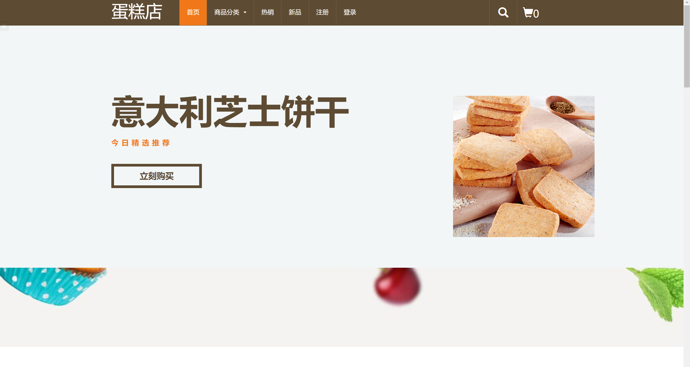
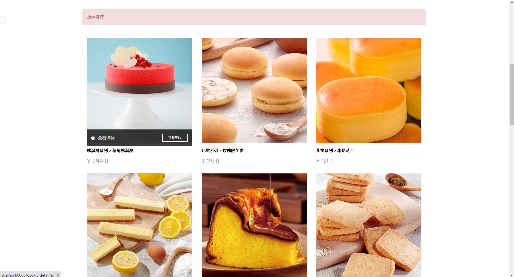
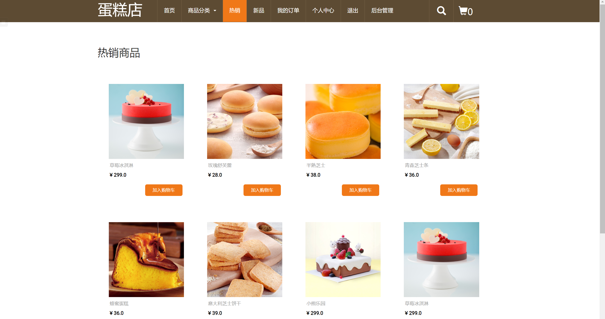
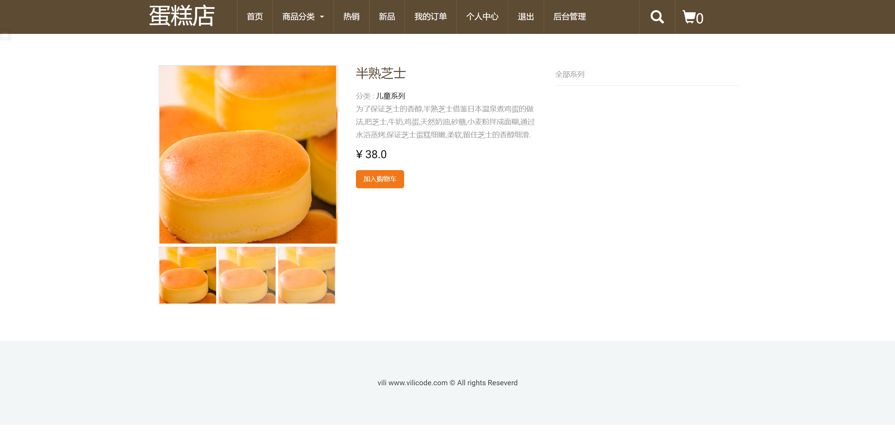
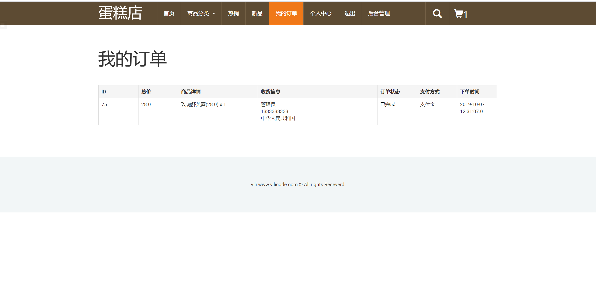
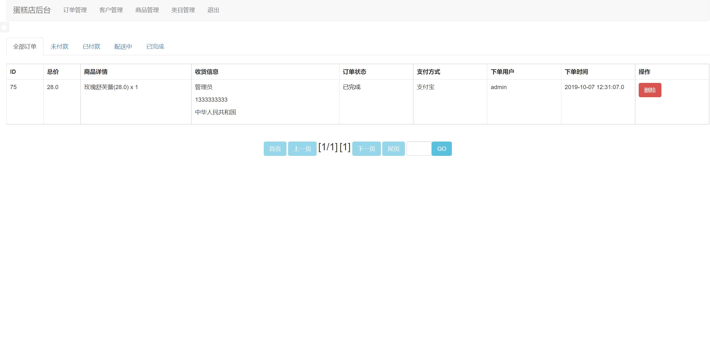
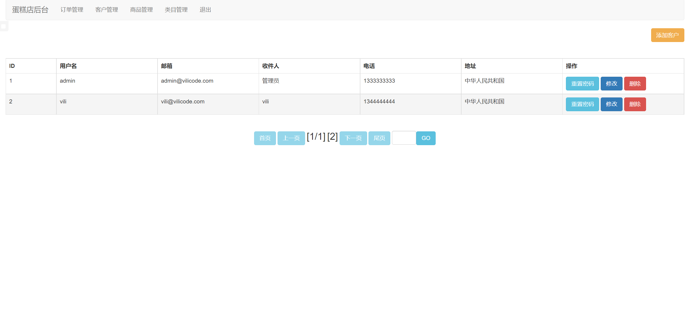
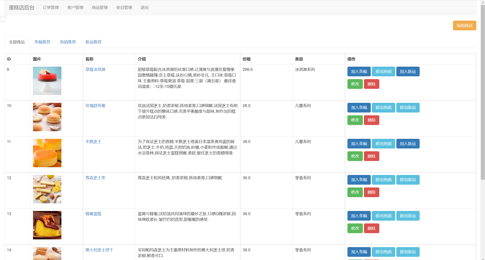
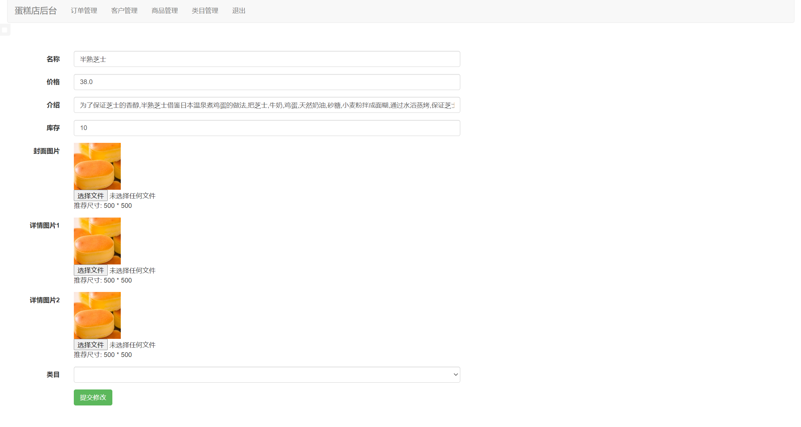
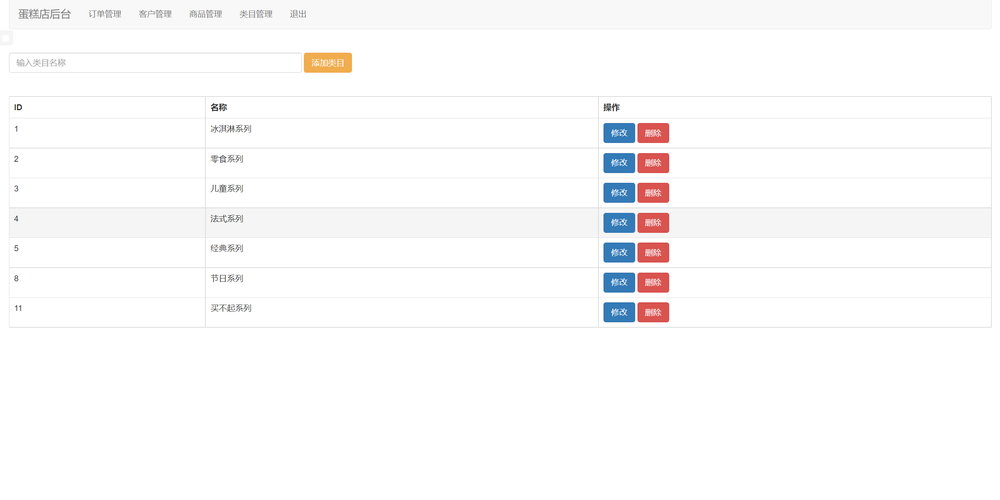

## 基于JSP+Servlet实现的网上蛋糕商城系统

- <b>完整代码获取地址：从戎源码网 ([https://armycodes.com/](https://armycodes.com/))</b>
- <b>技术探讨、资料分享，请加QQ群：692619798</b> 
- <b>作者微信：19941326836  QQ：952045282</b> 
- <b>承接计算机毕业设计、Java毕业设计、Python毕业设计、深度学习、机器学习</b>
- <b>选题+开题报告+任务书+程序定制+安装调试+论文+答辩ppt 一条龙服务</b>
- <b>所有选题地址 ([https://github.com/YuLin-Coder/AllProjectCatalog](https://github.com/YuLin-Coder/AllProjectCatalog)) </b>

## 项目介绍
基于JSP+Servlet实现的网上蛋糕商城系统，主要功能如下

【前台功能】
1. 商品基本展示,包括推荐商品展示和类型商品展示.
2. 推荐商品包括条幅推荐,热销推荐和新品推荐.
3. 按照商品类型展示商品.
4. 商品详细信息展示.
5. 商品加入购物车.
6. 修改购物车内商品信息,例如数量等.
7. 用户登录.
8. 用户注册.
9. 修改个人信息,包括密码和收获信息.
10. 购物车付款.
11. 用户订单查询.
12. 根据关键字搜索商品.

【后台功能】
当管理员用户登录后会显示后台管理按钮,点击介意进入后台管理页面*
1. 订单操作:包括按状态查询订单,修改订单状态(发货,完成,删除).
2. 用户操作:包括查询所有用户,新增用户,修改用户密码,修改用户信息和删除用户.
3. 商品类目操作:包括查看所有类目,增加商品类目,修改商品类目信息以及删除商品类目.
4. 商品操作:包括查询所有商品,新增商品,修改现有商品信息以及删除商品.

## 项目技术
- 编程语言：Java
- 数据库：MySQL
- 前端技术：JSP、JavaScript、bootstrap、JQuery
- 后端技术：Servlet、JDBC

## 运行环境
- JDK版本：JDK1.8及以上
- 开发工具：IDEA、Ecplise、Myecplise都可以
- 数据库: MySQL5.7及以上

## 运行截图

